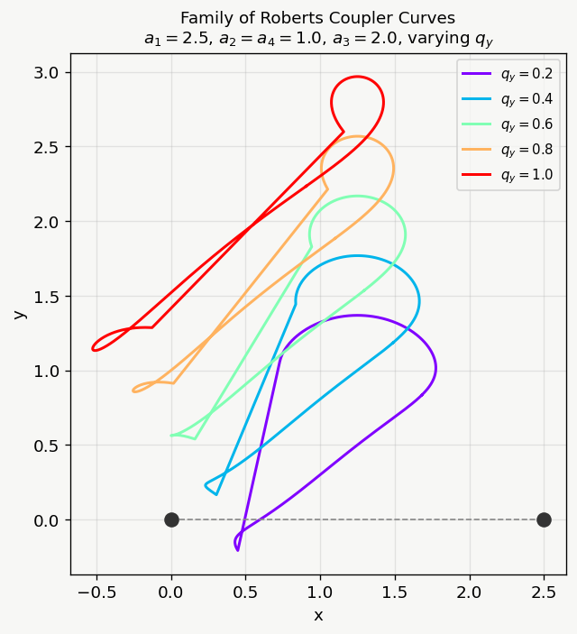
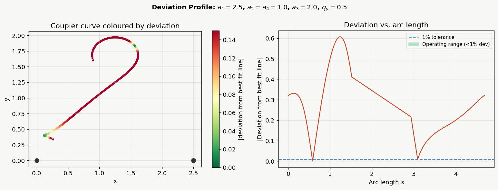

# Roberts Linkage Coupler Curve Analysis

Python tools for studying the coupler curve of the four-bar **Roberts linkage**,
in the context of designing a low-frequency vibration isolator for seismometers.

This work is part of a research internship at **IUCAA** (Inter-University Centre
for Astronomy and Astrophysics), Pune, under **Dr. Apratim Ganguly** (LIGO-India),
reproducing and extending the results of:

- J. Angeles, *Coupler Curves of Planar Four-Bar Linkages*
- Baskar, Plecnik & Hauenstein (2023), *Finding Straight Line Generators through
  the Approximate Synthesis of Symmetric Four-Bar Coupler Curves*

## Background

A four-bar linkage traces a closed algebraic curve (the **coupler curve**) of
degree 6 (a tricircular sextic) as its crank rotates. The **Roberts linkage** is
a symmetric special case whose coupler curve has a near-straight central segment
— historically used for straight-line motion generation, and here being explored
as a flexure-free suspension mechanism for a seismometer proof mass, where
near-perfect straight-line motion minimizes unwanted cross-axis restoring forces.

Full derivation, including the Freudenstein four-bar solution, the Weierstrass
substitution, dialytic elimination to the sextic, the isotropic-coordinate
(Baskar et al.) reformulation, Roberts cognate triplets, and the symmetry
classification, is in [`notes/coupler_curves_notes.pdf`](notes/coupler_curves_notes.pdf).

## Repository layout

```
roberts-linkage/
├── src/
│   └── roberts_linkage.py     # main analysis script (Python port of RobertsLinkage.nb)
├── notes/
│   └── coupler_curves_notes.pdf   # derivation notes (Angeles + Baskar et al.)
├── figures/                   # sample output plots
├── requirements.txt
└── README.md
```

## Setup

```bash
git clone https://github.com/<your-username>/roberts-linkage.git
cd roberts-linkage
pip install -r requirements.txt
```

Requires Python 3.9+.

## Usage

```bash
cd src
python roberts_linkage.py
```

You'll be prompted to choose a section to run:

| Choice | Section | Description |
|---|---|---|
| `1` | Interactive explorer | Matplotlib sliders for `a1, a2, a3, qy`; live coupler curve + RMS deviation |
| `2` | Deviation landscape | Grid scan of RMS straight-line deviation over `(a2, qy)` — surface + contour plot (~20s) |
| `3` | Optimisation | Global search (`scipy.differential_evolution`) for the `(a2, qy)` minimizing straight-line deviation (~1 min) |
| `4` | Family of curves | Coupler curves for a sweep of `qy`, fixed `a1, a2, a3` |
| `5` | Deviation profile | Pointwise deviation from best-fit line vs. arc length, with 1% tolerance band — identifies usable seismometer operating range |
| `6` | Symbolic determinant | SymPy evaluation of the 4×4 isotropic-coordinate determinant (eq. 5, Baskar et al.) for the Roberts case (~1–2 min) |
| `all` | Fast plots only | Runs sections 4 and 5 |

Each section can also be imported and called directly, e.g.:

```python
from roberts_linkage import roberts_trace, straight_line_deviation

pts = roberts_trace(a1=2.5, a2=1.0, a3=2.0, qy=0.5, npts=800)
dev = straight_line_deviation(pts)
```

### Sample output

| Family of coupler curves | Deviation profile |
|---|---|
|  |  |

## Known issue — symbolic determinant degree mismatch

Running section `6` (`symbolic_determinant()`) currently reports the coupler
trace polynomial as **degree 3 in `X` and degree 3 in `X*`** (14 monomials),
whereas the notes derive **degree 6 in each** (sextic, circularity-3, 16
monomials after specialising to the Roberts case `Q* = 1 - Q`, `l1 = l3`).

The matrix `M` in `symbolic_determinant()` is coded to match eq. (5) of
Baskar et al. entry-by-entry, but the resulting degree doesn't match the
hand derivation in the notes (Section 3.6). This needs to be tracked down —
likely either a sign/index slip in one of the four matrix entries, or a
mismatch between "degree in X alone" vs. the total joint degree used in the
notes' Bézout argument. Flagging here rather than silently patching, since
getting the determinant exactly right matters for everything downstream.

If you spot the bug, open a PR or issue.

## `src/linkage1.1.2.py`

A corrected kinematic model of the physical linkage as actually built and
verified in Linkage. Unlike `roberts_linkage.py`'s coupler-curve/sextic
analysis, this file matches the real six-link topology (no direct C-D
link; P and L are independent apexes on the same base C-D) and includes:

- Forward kinematics for the dual-driven (A, B counter-rotating) mechanism
- An interactive explorer with sliders for θ, L depth, q, and W
- A stability-crossing search (`find_q_crossing` / `solve_q_crossing`)
  that locates the base depth q at which the load point's trace flips
  from convex to concave

See `notes/VSP_code_doc.pdf` for full function documentation.

## Acknowledgements

Supervised by Dr. Apratim Ganguly, IUCAA. Built on the theoretical framework of
Angeles and of Baskar, Plecnik & Hauenstein (2023) and the ultra low frequency roberts linkage vibration isolator model by Dumas & Blair(2010)

